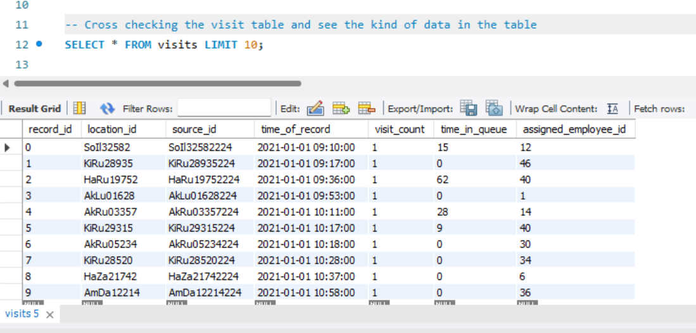
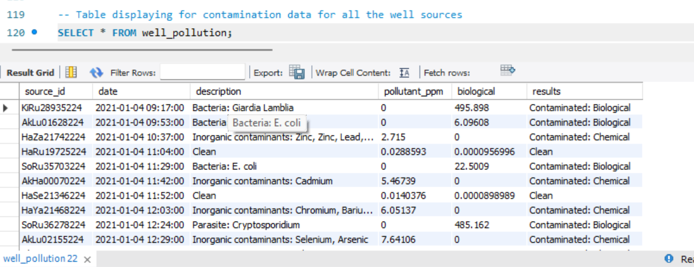

# MAJI_NDOGO_WATER_CRISIS_1--TAKING_A_DIVE_SQL

## Introduction
Here is a story of Maji Ndogo, a land boisterous with abundance of water with rivers flowing around different axis in the country. There came a time when there was drought and the officials who were supposed to work towards solving the water crises were corrupt and greedy sharing the resources needed to turn around the lives of the people. Due to this, voices arose seeking lasting solutions to the problems on ground. This gave rise to some concerned citizens coming together to create a team of hired experts consisting of engineers, field workers, scientists, and analysts to work towards making a difference. 

This project on Maji Ndogo Water Services spans into 4 SQL projects and tackles one of the UN-SDG Goals, Clean Water and Sanitation (the 6th of the SDGs), a sample database called md_water_services with 60,000 records was analyzed in this SQL project. I’ve done an exploratory analysis using basic to advanced SQL queries.

The raw dataset was provided by Explore AI Academy and transferred into [google drive](https://drive.google.com/file/d/12G7xt3EEWLg8IYA8mJBr0OBhNpxBczB3/view?usp=drive_link).

I imported the SQL script into the SQL database in my local machine and carried out the analysis.

## Problem Statement
In order to make sense of the immense data throve and derive meaningful insights, one has to take a look into the data available. Cleaning data is one crucial step in the data analysis process. This is because data in its raw state can contain errors, missing values, inconsistent data and other miscellaneous errors that can impede accuracy, reliability and relatability of the data analysis process.

So, by taking a deep dive into the dataset and studying the data dictionary provided in the list of tables, I looked for the relationship between the tables and also came up with a few activities to be done.
1.	Getting to know the data
2.	Diving into the sources
3.	Unpacking the visits to water sources
4.	Assessing the qualities of water sources
5.	Investigating any water pollution issues

## Data Analysis
### 1.	Getting to know the data.
   
I started by displaying the tables present in the database. This query was done using SHOW TABLES. This query gave the number of tables and the names of the tables present.

 
 
I also took a look at each of the tables to know the information it contained

 

Looking at one of the tables, specifically the water_pollution table, this table has information on the water sources, the date the sources were visited and the time of visit, the description if the sources were clean or polluted, the quantity of pollutant present if polluted in part per million (ppm), the biological pollutant present and the result of the pollution if contaminated or clean.

The data_dictionary was viewed. It contained the names of the tables in the dataset and the columns of each table, describing the type of data in columns of each individual tables. It also indicated the relationship that existed between the tables.

 

### 2.	Diving into the water sources.

I took a look at the water sources table and queried the unique type of water sources available. The result I got were tap_in_home, well, tap_in_home_broken, river and shared_tap.

 

From these unique water sources identified, the information provided were that

a.	River: This is an open source that has a high risk of contamination either with biological or other contaminants. This can be regarded as the worst type of water with respect to other sources in the table

b.	Well: This is a source that is drawn from underground water. As a closed water source, it has less contamination in contrast to the river. With aging infrastructure, it might not be clean.

c.	Shared_tap: This is a tap shared by the public.

d.	Tap_in_home: These are the taps in the homes of the citizens of Maji Ndogo. On average, about 6 people live together so each of the taps serve about 6 people.

e.	Tap_in_home_broken: These are taps in home but no longer functional. This might be due to burst pipes, broken pumps or water treatment plant no longer working.

Another information provided as regards tap_in_home was that about 6-10 million people have running water installed in their homes in Maji Ndogo, including broken taps. The surveyors combined the data of many households together into a single record. 

For example, pulling the first record in the water_sources table below. 

  

It can be seen that the first record ¬_AkHa00000224_ with the type of water source as tap_in_home serves 956 people. And if a tap in home serves about 6 people, 
    
    then (956 ÷ 6 ≈ 160)
    
So a record for 1 tap_in_home or tap_in_home_broken actually refers to multiple homes and the sum of people living in these home equals number of people served as can be seen in the table.

### 3.	packing the visits to water sources
   
I pulled up the visits table and took a glimpse into how the table was structured

 

From this table, information concerning a source of water can be obtained. Information such as the location of the source, date and time the survey was taken for a particular source, the employee_id that did the survey was taken, the number of visits made to the source and the amount of time an individual spends on the queue before water can be gotten.
With this information available, I queried if the time in queue had an unimaginable figure say, say 500 mins (8 hours).

 

108 results were returned. These results showed that there were sources that took 8hours of queue to get water. These sources of water were determined from another table using the source_id present in the visits table matched with the source_id in the water_source table. So, taking a few of the source_id with time_in queue > 500, a query was written to cross_reference on the water_source table. The source_id taken were "AkKi00881224", "AkLu01628224", "AkRu05234224", "HaRu19601224", "HaZa21742224", "SoRu36096224", "SoRu37635224", "SoRu38776224”.

 

The sources I got from the 8 source_id I queried were “shared_tap”, “well” and “tap_in_home_broken”.

### 4.	Assessing the quality of water sources
   
The water_quality was pulled up and looked into.

 

This table has record_id, subjective_quality_score and visit_count for each record. It also contained a quality score for each visit made about a water source that was assigned. A score was assigned to each source from 1 being bad to 10 for a good clean water. It was seen that multiple visits were made to shared taps and there were no revisits to other types of water sources that are good like taps_in_home.

 

With this in mind, I inspected if there was any record with a subjective_quality_score of 10 only checking for taps_in_home and having a second visit to the source. 

 

This returned 218 data rows. This means there might likely have been a mistake made by some of the employees. Because there shouldn’t have been a revisit to a water source that is clean and having a perfect subjective_quality_score. This also means there might be a likelihood of errors in this dataset.

### 5.	Investigating pollution issues
The well_pollution table was investigated

 

From this table, it could be seen that contamination and pollution was recorded for all the well sources. The results column indicated the quality of the water. Some are contaminated with biological contaminants, some with chemical contaminants and others with the presence of heavy metals and other pollutants. The source_id of each test was recorded which could be cross-referenced with another table that could give the precise location of that source in Maji Ndogo. The units in the biological column is given in colony-forming unit per milliliter (CFU/mL) which is the measure of biological contamination in the water. Scientifically, 0 is clean and anything >0.01 is contaminated. 

A query was written to check if the results was Clean but the biological column was > 0.01

            SELECT * FROM well_pollution
	            WHERE results = "Clean" AND biological >= 0.01;

Further checking the integrity of the data, there were some of the records that had clean bacteria in the description column and the results column indicated clean. This might mean that there were inconsistencies in the data and these discrepancies had to be corrected. It was discovered that whenever the word clean bacteria were written, the result was a clean water. There can’t be a clean bacterium with clean water.

Therefore, query was written to check for the records with description as “clean” and having additional character(s) after it. 38 descriptions were returned.

            SELECT * FROM well_pollution 
		        	WHERE description LIKE "Clean_%";

Two sets of descriptions were returned which were “Clean Bacteria: E. coli” and “Clean Bacteria: Giardia Lamblia”. These descriptions were fixed so as not to be encountered subsequently, including the column with biological contaminant > 0.01 with the results as clean.

  
  
  
  
## Conclusion
1.	The quality of water can be deduced as the whole point of this survey. 
2.	The table relates one to another with the visits table linking each source visited to an employee. The details of the employee are viewable in the employee table. 
3.	Taking a look into each of the table provides information on the type of water source, the quality of the water, the type of contamination and pollution of a well source, the number of visits to a water source, the employee attached to a source, the number of people a source served and the time (in minutes) spent on a queue before getting water.
4.	The insight provided from this dataset gave reasons to research for ways of optimizing water sources to better serve the community and to reduce the long queues at shared sources.

The sql script can be found [here](md_query.sql)

In the next Maji Ndogo project, I will be looking at "Finding insights",

  ## END!

